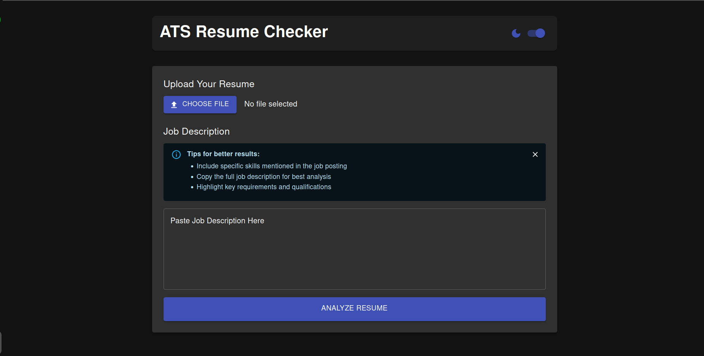

# ATS Resume Checker



> A full-stack web application that analyzes resumes against job descriptions to calculate ATS (Applicant Tracking System) compatibility scores.

## 📋 Features

- ✅ Resume parsing (PDF/DOCX)
- ✅ Job description analysis
- ✅ ATS compatibility scoring (0-100%)
- ✅ Missing keyword detection
- ✅ Improvement suggestions
- ✅ Dark/Light mode toggle
- ✅ Job description examples
- ✅ Responsive design

## 🔧 Technologies Used

**Frontend:**

- React.js
- Material-UI
- Framer Motion (animations)
- Axios (API calls)

**Backend:**

- Node.js
- Express.js
- MongoDB
- PDF-parse (PDF text extraction)
- DOCX (Word document parsing)
- Natural (NLP keyword matching)

## 🚀 Installation

### Prerequisites

- Node.js (v18+)
- npm (v9+)
- MongoDB

### Linux Setup

1. **Install system dependencies:**

   ```bash
   sudo apt update
   sudo apt install -y nodejs npm mongodb git
   ```

2. **Clone the repository:**

   ```bash
   git clone https://github.com/deepakbalusupati/ATS-Resume-Checker.git
   cd ATS-Resume-Checker
   ```

3. **Start MongoDB:**
   ```bash
   sudo systemctl start mongodb
   sudo systemctl enable mongodb
   ```

### Windows Setup

1. **Install prerequisites:**

   - Install [Node.js](https://nodejs.org/) (v18+)
   - Install [MongoDB Community Edition](https://www.mongodb.com/try/download/community)
   - Install [Git](https://git-scm.com/download/win)

2. **Clone the repository:**

   ```powershell
   git clone https://github.com/deepakbalusupati/ATS-Resume-Checker.git
   cd ATS-Resume-Checker
   ```

3. **Start MongoDB:**
   - MongoDB should be running as a Windows service if you selected that option during installation
   - Alternatively, you can start it manually from the installation directory:
     ```powershell
     "C:\Program Files\MongoDB\Server\{version}\bin\mongod.exe" --dbpath="C:\data\db"
     ```

### Backend Setup (All Platforms)

1. **Navigate to server directory:**

   ```bash
   cd server
   ```

2. **Install dependencies:**

   ```bash
   npm install
   ```

3. **Create environment file:**
   Create a file named `.env` in the server directory with the following content:
   ```
   PORT=5001
   MONGODB_URI=mongodb://localhost:27017/atsresume
   CLIENT_URL=http://localhost:3000
   ```

### Frontend Setup (All Platforms)

1. **Navigate to client directory:**

   ```bash
   cd ../client
   ```

2. **Install dependencies:**

   ```bash
   npm install
   ```

3. **Create environment file (optional):**
   Create a file named `.env` in the client directory to customize the API URL:
   ```
   REACT_APP_API_URL=http://localhost:5001
   ```
   Note: This step is optional as the application will use http://localhost:5001 by default.

## 🏃‍♂️ Running the Application

1. **Start backend server:**

   ```bash
   cd server
   npm run dev
   ```

   (Runs on http://localhost:5001)

2. **Start frontend:**
   ```bash
   cd ../client
   npm start
   ```
   (Opens http://localhost:3000 automatically)

## 📁 Project Structure

```
ats-resume-checker/
├── client/                  # React frontend
│   ├── public/
│   ├── src/
│   │   ├── App.js           # Main application
│   │   └── ...
│   └── package.json
├── server/                  # Node.js backend
│   ├── server.js            # Main server file
│   ├── package.json
│   └── .env
└── README.md
```

## 📝 Usage

1. Upload a resume (PDF or DOCX)
2. Enter or paste a job description (or use examples)
3. Click "Analyze Resume"
4. View your:
   - ATS compatibility score
   - Keyword matches
   - Missing keywords
   - Improvement suggestions

## ❓ Troubleshooting

### Common Issues

**MongoDB Connection Errors:**

- Ensure MongoDB is running on your system
- Check that the connection string in `.env` is correct
- For Windows users, verify MongoDB is installed as a service or running manually

**API Connection Issues:**

- Make sure both frontend and backend servers are running
- Check that the port numbers match in your configuration (default: backend on 5001, frontend on 3000)
- Verify there are no firewall or antivirus programs blocking the connections
