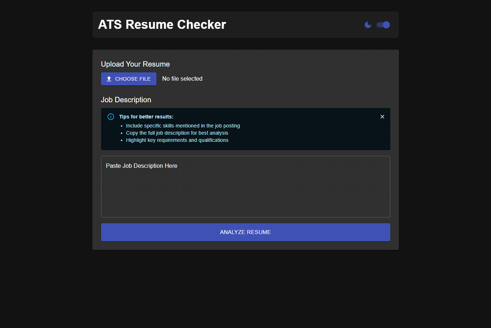

# ATS Resume Checker



A full-stack web application that analyzes resumes against job descriptions to calculate ATS (Applicant Tracking System) compatibility scores.

## Features

- ✅ Resume parsing (PDF/DOCX)
- ✅ Job description analysis
- ✅ ATS compatibility scoring (0-100%)
- ✅ Missing keyword detection
- ✅ Improvement suggestions
- ✅ Dark/Light mode toggle
- ✅ Job description examples
- ✅ Responsive design

## Technologies Used

**Frontend:**
- React.js
- Material-UI
- Framer Motion (animations)
- Axios (API calls)

**Backend:**
- Node.js
- Express.js
- MongoDB
- PDF-parse (PDF text extraction)
- DOCX (Word document parsing)
- Natural (NLP keyword matching)

## Installation

### Prerequisites
- Ubuntu 22.04 LTS
- Node.js (v18+)
- npm (v9+)
- MongoDB

### Setup

1. **Install system dependencies:**
   ```bash
   sudo apt update
   sudo apt install -y nodejs npm mongodb git python3 python3-pip

2. **Clone the repository:**
   ```bash
   git clone https://github.com/yourusername/ats-resume-checker.git
   cd ats-resume-checker

3. **Backend setup**
   ```bash
   cd server
   npm install
   cp .env.example .env

4. **Frontend setup:**
   ```bash
   cd ../client
   npm install

5. **Start MongoDB:**
   ```bash
   sudo systemctl start mongodb
   sudo systemctl enable mongodb

## Running the Application

1. **Start backend server:**
   ```bash
   cd server
   npm run dev
(Runs on http://localhost:5001)

2. **Start frontend:**
   ```bash
   cd ../client
   npm start
(Opens http://localhost:3000 automatically)

## Project Structure
ats-resume-checker/
├── client/                  # React frontend
│   ├── public/
│   ├── src/
│   │   ├── components/
│   │   ├── App.js          # Main application
│   │   └── ...
│   └── package.json
├── server/                  # Node.js backend
│   ├── server.js           # Main server file
│   ├── package.json
│   └── .env
└── README.md

## Configuration
### Backend Environment Variables

Create .env in server/:
```bash
MONGODB_URI=mongodb://localhost:27017/atsresume
PORT=5001
```

## Usage

1. Upload a resume (PDF or DOCX)
2. Enter or paste a job description (or use examples)
3. Click "Analyze Resume"
4. View your:
   ATS compatibility score
   Keyword matches
   Missing keywords
   Improvement suggestions

## License
MIT License - Free for personal and commercial use